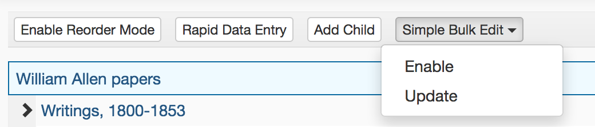
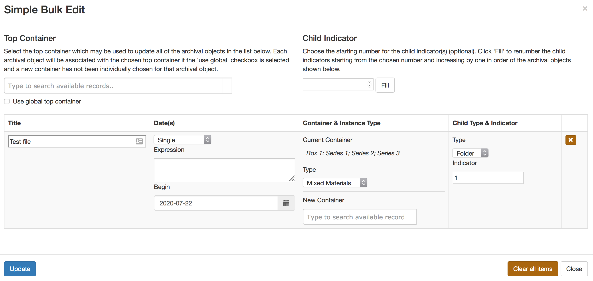

Simple Bulk Edit Plugin
================================

An ArchivesSpace plugin that adds the ability to bulk edit archival objects - 
specifically the title, date(s) and container instance including the child type and indicator.

An example use case for this would be during re-processing of a collection after a processor
has physically moved a set of folders into a new container, used re-order mode to arrange
the archival objects in ArchivesSpace but still needs to update the instance
data in ArchivesSpace to match the new arrangement.

## Installing

To install, just activate the plugin in your config.rb file by
including an entry such as:

     # If you have other plugins loaded, just add 'aspace_simple_bulk_edit' to the list
     AppConfig[:plugins] = ['local', 'other_plugins', 'aspace_simple_bulk_edit']
     
## Using the plugin
The plugin adds a new button to the tree toolbar that allows a user to multiselect a set of
archival objects (much like in re-order mode) and then apply edits to those objects. Since the 
plugin selection mechanism works on the same principe as re-order mode, a selected archival object's
children cannot be selected themselves.



The button in the tree toolbar has two options: enable and update. Selecting enable allows
the user to select a set of archival objects in any order. Once the user has selected a set
of archival objects, the user then chooses update from the toolbar `Simple Bulk Edit`
button menu.

This brings up a new modal window that summarizes the current information about the set of
archival objects selected. The fields that are available for editing for each object are

```
Title
Date - Date Type
Date - Date Expression
Date - Date Begin
Date - Date End
Instance - Instance Type
Instance - Top Container
Child Indicator
Child Type
```



### Date and Instance data
The date and instance data are those taken from the first creation date and the first container 
instance associated with the archival object. It does **not** allow the user to edit all dates 
and all instances.

There is also a global top container linker (with checkbox) that allows the user to 
select a top container to link to all of the archival objects that do not have a new top
container individually selected in the summary row for that archival object.

Additionally, there is an option to fill the child indicators starting from a user entered start
point. The child indicators will be filled in the same order as the archival objects are listed
in the windows (the order in which they were originally selected).

An archival object can be removed from the summary list at any point if it was selecetd by accident.

### Date, Instance & Child Types Selects
Selecting the 'blank' option from any of the types (date, instance, child) will cause that piece
of data to be removed from the archival object. In the case of instance type and child type, the
data will also be removed from the children of the archival object.

Example: A folder has a linked container instance initially, but the user chooses the blank option and updates
the archival object. The archival object and all of its descendants will no longer have that
container instance.

Once the user has updated any information necessary, they choose the update button in the modal.
The archival objects will be updated with the new information.

Note that children of an archival object will inherit any changes to the instance type,
top container, child type, and child indicator.

### Creating a New Date, Container Instance and Child Type & Indicator
If an archival object does not have a date, instance or child type associated with it, simply
entering data in the summary edit wndow and then udpating the archival object will create
associated date and container instances.